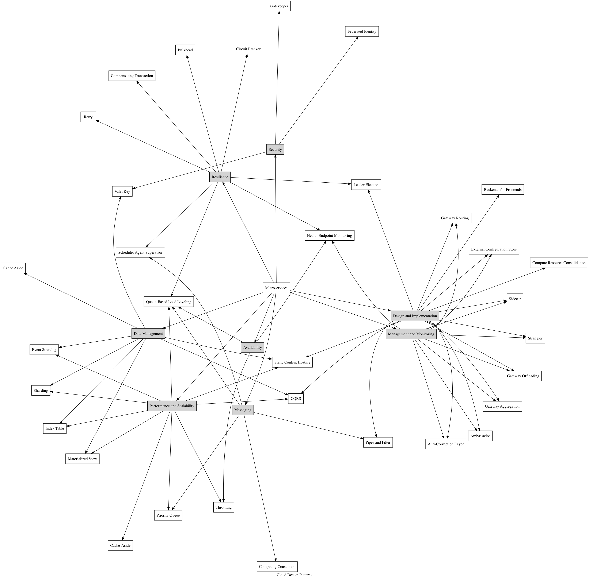

# full-stack-microservice

The goal is to design a working microservice architecture with the following components:

## Infrastructure

- Terraform

## Load Balancer

- Nginx
- HAProxy
- Traefik
- Envoy
- Linkerd
- Fabio

## Scheduler

- Nomad

## Orchestration

- Docker Swarm
- Kubernetes

## API Gateway

- Kong
- Tyk
- express-gateway
- API Umbrella

## Service Mesh

- Linkerd
- Conduit
- Istio

## Search

- Elasticsearch
- Solr
- Bleeve
- DNA Search

## Cache

- Redis (also for rate-limiting, time-series analytics)
- Memcached
- Varnish
- Zipnish

## Time-Series Database

- TimescaleDB
- InfluxDB (cluster is only available in Enterprise version though)

## Tracing

- OpenTracing
- OpenZipkin
- Jaeger

## Auth

- OpenId Connect
- OAuth2
- Identity Server 4

## Secrets

- DockerSecrets
- Vault

## Transport

- Kafka
- Nats
- gRPC
- protobuff
- Thrift
- Avro
- RabbitMQ
- ZeroMQ

## Documentation

- Swagger

## API Standards

- JSON Schema
- JSON API

## Security

- letsencrypt

### Others

- Client/server-side service discovery (nodejs resilient, etcd, Linkerd, Consul)
- Consul/etcd setup
- Circuit breaker
- Docker-compose or nomad setup
- Dynamic ports and service registry
- 12-Factor app practices
- Heteregenous clients (nodejs, go, python)
- Transport protocol (kafka, nats, rabbitmq, rpc, grpc, protobuff)
- Caching (Redis/memcached)
- API Gateway (kong, API Umbrella, AWS API Gateway)
- OpenID connect
- Sharding/Clustering of storage
- Vault
- RASA NLU
- Opentracing with GRPC
- GRPC security with Go, nodejs, python
- GRPC with graphql adapter
- Finanz example
- Create architecture diagram for all the different setups

