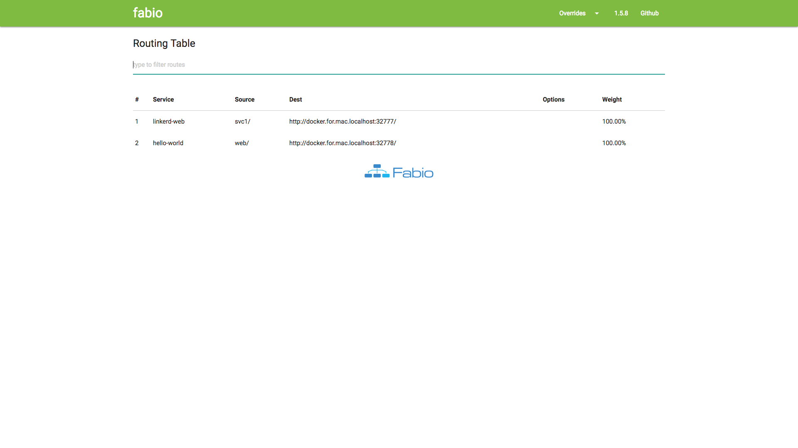
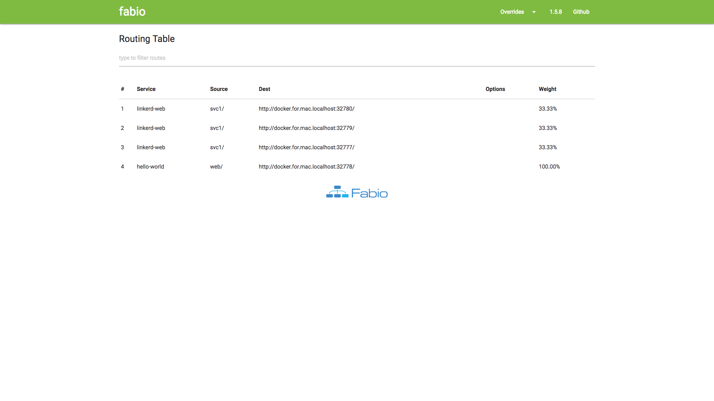

# Fabio




Load balancing can be done with `fabio`.

## Start

```bash
$ docker-compose up -d
# or
$ make up
```

## UI

Admin UI is available at [localhost:9998](localhost:9998).

## Registering services with docker-compose


In this example, we set the `urlprefix-svc1/`, which means that this service is accessible through `$ curl -H "Host: svc" localhost:9999`.

```yaml
  svc1:
    image: alextanhongpin/linkerd-web
    ports:
      - 127.0.0.1::3000
    environment:
      - SERVICE_TAGS=urlprefix-svc1/
      - SERVICE_CHECK_HTTP=/ # The endpoint for the health checkpoint
```

## Test

We registered two services, one with the hostname `svc1` and another with the hostname `web`:

Test `svc1`:

```bash
$ curl -H "Host: svc1" localhost:9999
```

Output:

```bash
{"hostname":"434640b2970d"}
```

Test `web`:

```
$ curl -H "Host: web" localhost:9999
```


Output:

```
<html>
<head>
	<title>Hello world!</title>
	<link href='http://fonts.googleapis.com/css?family=Open+Sans:400,700' rel='stylesheet' type='text/css'>
	<style>
	body {
		background-color: white;
		text-align: center;
		padding: 50px;
		font-family: "Open Sans","Helvetica Neue",Helvetica,Arial,sans-serif;
	}

	#logo {
		margin-bottom: 40px;
	}
	</style>
</head>
<body>
	
	<h1>Hello world!</h1>
	<h3>My hostname is b5b73bd2c9a9</h3>	</body>
</html>
```

## Scale

To test the load balancing, we need to scale the services:

```bash
$ docker-compose up -d --scale svc1=3
```

Test:

```bash
$ curl -H "Host: svc1" localhost:9999
```

Output:

```
{"hostname":"434640b2970d"}
{"hostname":"44b05366aa03"}
{"hostname":"b41b063b611f"}
{"hostname":"b41b063b611f"}
```



## Stop

```bash
$ docker-compose down
# or
$ make down
```